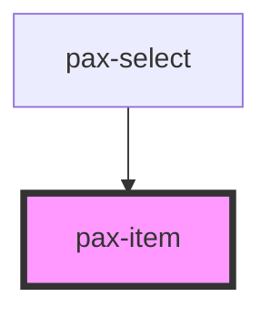

# pax-item

The `pax-item` is a wrapper element that unifies how up to three elements are placed in relation to each other.

## Notes

* Amongst other things, this is used for form inputs like `pax-label` and `pax-checkbox`, `pax-radio` or for icons in front of or after text, i.e. inside `pax-buttom`.
* The `color` attribute will only take effect when nested directly inside the `pax-list` element.

## Usage

See `pax-button`, `pax-input`, `pax-checkbox`, `pax-radio`, and others for usage.

## Basic

<pax-item><span slot="start">Lorem ipsum (start slot)</span>Lorem ipsum<span slot="end">Lorem ipsum (end slot)</span></pax-item>

```html
<pax-item><span slot="start">Lorem ipsum (start slot)</span>Lorem ipsum<span slot="end">Lorem ipsum (end slot)</span></pax-item>
```


<!-- Auto Generated Below -->


## Properties

| Property | Attribute | Description                                                                                              | Type     | Default     |
| -------- | --------- | -------------------------------------------------------------------------------------------------------- | -------- | ----------- |
| `color`  | `color`   | The color to use from the pax color palette. Options are: `'success'`, `'warning'`, `'danger'`, `'dark'` | `string` | `undefined` |


## Dependencies

### Used by

 - [pax-select](../select)

### Graph


----------------------------------------------

*Built with [StencilJS](https://stenciljs.com/)*
