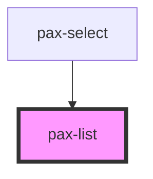

# pax-list

The `pax-list` is mainly a layout component that provides a way to layout out `pax-item`s either as a list or in line.

## Notes

* The `pax-list` only works in combination with the `pax-item` element.
* This component is <b>not scoped</b>.

## Usage

<pax-row>
    <pax-col col-sm-6>
        <div class="browser">
            <div class="browser-toolbar">
                <div class="browser-dot"></div>
                <div class="browser-dot"></div>
                <div class="browser-dot"></div>
            </div>
            <div class="browser-body">
                <pax-list>
                    <pax-item>Unwiderrufliches Prämiendepot</pax-item>
                    <pax-item>Verfügbares Prämiendepot<b slot="end">17’797,00 CHF</b></pax-item>
                    <pax-item>Letztjähriges Prämiendepot<b slot="end">234’567,89 CHF</b></pax-item>
                    <pax-item>Zukünftiges Prämiendepot<b slot="end">335’512,01 CHF</b></pax-item>
                    <pax-item>Überschussystem<b slot="end">Reduktion der Prämie</b></pax-item>
                </pax-list>
            </div>
        </div>
    </pax-col>
    <pax-col col-sm-6>
        <div class="browser">
            <div class="browser-toolbar">
                <div class="browser-dot"></div>
                <div class="browser-dot"></div>
                <div class="browser-dot"></div>
            </div>
            <div class="browser-body">
                <pax-list lines>
                    <pax-item color>Unwiderrufliches Prämiendepot</pax-item>
                    <pax-item color="success">Verfügbares Prämiendepot<b slot="end">17’797,00 CHF</b></pax-item>
                    <pax-item color="danger">Letztjähriges Prämiendepot<b slot="end">234’567,89 CHF</b></pax-item>
                    <pax-item color="dark">Zukünftiges Prämiendepot<b slot="end">335’512,01 CHF</b></pax-item>
                    <pax-item color="warning">Überschussystem<b slot="end">Reduktion der Prämie</b></pax-item>
                </pax-list>
            </div>
        </div>
    </pax-col>
</pax-row>

## Basic

<pax-list>
    <pax-item>Just my luck, no ice.</pax-item>
    <pax-item>Is this my espresso machine? Wh-what is-h-how did you get my espresso machine?<b slot="end">Lorem ipsum</b></pax-item>
    <pax-item>I gave it a cold? I gave it a virus. A computer virus.<b slot="end">Lorem ipsum</b></pax-item>
    <pax-item>I was part of something special. Must go faster.<b slot="end">Lorem ipsum</b></pax-item>
    <pax-item>God help us, we're in the hands of engineers.<b slot="end">Lorem ipsum</b></pax-item>
</pax-list>

```html
<pax-list>
    <pax-item>Just my luck, no ice.</pax-item>
    <pax-item>Is this my espresso machine? Wh-what is-h-how did you get my espresso machine?<b slot="end">Lorem ipsum</b></pax-item>
    <pax-item>I gave it a cold? I gave it a virus. A computer virus.<b slot="end">Lorem ipsum</b></pax-item>
    <pax-item>I was part of something special. Must go faster.<b slot="end">Lorem ipsum</b></pax-item>
    <pax-item>God help us, we're in the hands of engineers.<b slot="end">Lorem ipsum</b></pax-item>
</pax-list>
```

### with lines

<pax-list lines>
    <pax-item>Just my luck, no ice.</pax-item>
    <pax-item>Is this my espresso machine? Wh-what is-h-how did you get my espresso machine?<b slot="end">Lorem ipsum</b></pax-item>
    <pax-item>I gave it a cold? I gave it a virus. A computer virus.<b slot="end">Lorem ipsum</b></pax-item>
    <pax-item>I was part of something special. Must go faster.<b slot="end">Lorem ipsum</b></pax-item>
    <pax-item>God help us, we're in the hands of engineers.<b slot="end">Lorem ipsum</b></pax-item>
</pax-list>

```html
<pax-list lines>
    <pax-item>Just my luck, no ice.</pax-item>
    <pax-item>Is this my espresso machine? Wh-what is-h-how did you get my espresso machine?<b slot="end">Lorem ipsum</b></pax-item>
    <pax-item>I gave it a cold? I gave it a virus. A computer virus.<b slot="end">Lorem ipsum</b></pax-item>
    <pax-item>I was part of something special. Must go faster.<b slot="end">Lorem ipsum</b></pax-item>
    <pax-item>God help us, we're in the hands of engineers.<b slot="end">Lorem ipsum</b></pax-item>
</pax-list>
```

### with inset

<pax-list inset>
    <pax-item>Just my luck, no ice.</pax-item>
    <pax-item>Is this my espresso machine? Wh-what is-h-how did you get my espresso machine?<b slot="end">Lorem ipsum</b></pax-item>
    <pax-item>I gave it a cold? I gave it a virus. A computer virus.<b slot="end">Lorem ipsum</b></pax-item>
    <pax-item>I was part of something special. Must go faster.<b slot="end">Lorem ipsum</b></pax-item>
    <pax-item>God help us, we're in the hands of engineers.<b slot="end">Lorem ipsum</b></pax-item>
</pax-list>

```html
<pax-list inset>
    <pax-item>Just my luck, no ice.</pax-item>
    <pax-item>Is this my espresso machine? Wh-what is-h-how did you get my espresso machine?<b slot="end">Lorem ipsum</b></pax-item>
    <pax-item>I gave it a cold? I gave it a virus. A computer virus.<b slot="end">Lorem ipsum</b></pax-item>
    <pax-item>I was part of something special. Must go faster.<b slot="end">Lorem ipsum</b></pax-item>
    <pax-item>God help us, we're in the hands of engineers.<b slot="end">Lorem ipsum</b></pax-item>
</pax-list>
```

### with colors

The `color` attribute must be set on the `pax-item` elements. They will only
take effect when nested directly inside the `pax-list` element.

* Without a `color` value the `light` color is rendered.

#### Light

<pax-list>
    <pax-item color>Just my luck, no ice.<b slot="end">Lorem ipsum</b></pax-item>
</pax-list>

```html
<pax-list>
    <pax-item color>Just my luck, no ice.<b slot="end">Lorem ipsum</b></pax-item>
</pax-list>
```

#### Success

<pax-list>
    <pax-item color="success">Is this my espresso machine? Wh-what is-h-how did you get my espresso machine?<b slot="end">Lorem ipsum</b></pax-item>
</pax-list>

```html
<pax-list>
    <pax-item color="success">Is this my espresso machine? Wh-what is-h-how did you get my espresso machine?<b slot="end">Lorem ipsum</b></pax-item>
</pax-list>
```

#### Danger

<pax-list>
    <pax-item color="danger">I gave it a cold? I gave it a virus. A computer virus.<b slot="end">Lorem ipsum</b></pax-item>
</pax-list>

```html
<pax-list>
    <pax-item color="danger">I gave it a cold? I gave it a virus. A computer virus.<b slot="end">Lorem ipsum</b></pax-item>
</pax-list>
```

#### Dark

<pax-list>
    <pax-item color="dark">I was part of something special. Must go faster.<b slot="end">Lorem ipsum</b></pax-item>
</pax-list>

```html
<pax-list>
    <pax-item color="dark">I was part of something special. Must go faster.<b slot="end">Lorem ipsum</b></pax-item>
</pax-list>
```

#### Warning

<pax-list>
    <pax-item color="warning">God help us, we're in the hands of engineers.<b slot="end">Lorem ipsum</b></pax-item>
</pax-list>

```html
<pax-list>
    <pax-item color="warning">God help us, we're in the hands of engineers.<b slot="end">Lorem ipsum</b></pax-item>
</pax-list>
```

### with inline layout

<pax-list inline>
    <pax-item>
        <pax-badge>Badge</pax-badge>
    </pax-item>
    <pax-item>
        <pax-badge color="success">Badge</pax-badge>
    </pax-item>
    <pax-item>
        <pax-badge color="warning">Badge</pax-badge>
    </pax-item>
    <pax-item>
        <pax-badge color="danger">Badge</pax-badge>
    </pax-item>
    <pax-item>
        <pax-badge color="dark">Badge</pax-badge>
    </pax-item>
    <pax-item>
        <pax-badge color="light">Badge</pax-badge>
    </pax-item>
    <pax-item>
        <pax-badge color="ghost">Badge</pax-badge>
    </pax-item>
    <pax-item>
        <pax-badge></pax-badge>
    </pax-item>
</pax-list>

```html
<pax-list inline>
    <pax-item>
        <pax-badge>Badge</pax-badge>
    </pax-item>
    <pax-item>
        <pax-badge color="success">Badge</pax-badge>
    </pax-item>
    <pax-item>
        <pax-badge color="warning">Badge</pax-badge>
    </pax-item>
    <pax-item>
        <pax-badge color="danger">Badge</pax-badge>
    </pax-item>
    <pax-item>
        <pax-badge color="dark">Badge</pax-badge>
    </pax-item>
    <pax-item>
        <pax-badge color="light">Badge</pax-badge>
    </pax-item>
    <pax-item>
        <pax-badge color="ghost">Badge</pax-badge>
    </pax-item>
    <pax-item>
        <pax-badge></pax-badge>
    </pax-item>
</pax-list>
```


<!-- Auto Generated Below -->


## Properties

| Property | Attribute | Description                                                                                                        | Type      | Default |
| -------- | --------- | ------------------------------------------------------------------------------------------------------------------ | --------- | ------- |
| `inline` | `inline`  | If set, the list component will displayed in an inline layout.                                                     | `boolean` | `false` |
| `inset`  | `inset`   | If set, the list component gets displayed with a padding.                                                          | `boolean` | `false` |
| `lines`  | `lines`   | If set, the list component gets displayed with lines separating each row. Has no effect when `inline` is also set. | `boolean` | `false` |


## Dependencies

### Used by

 - [pax-select](../select)

### Graph


----------------------------------------------

*Built with [StencilJS](https://stenciljs.com/)*
