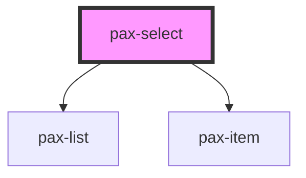

# pax-select

The `pax-select` represents a control that provides a menu of options. The options are provided via nested `pax-select-option` components.

## Notes

* A `name` attribute must be provided if it is used with a standard `<form>` element. A hidden input will be rendered that holds the value that will be submitted.
* It is possible to combine it with stacked or floating labels. Prefer floating labels.
* A single value can be selected.
* Invalid states are included, validation is not.

## Usage

<pax-grid>
  <pax-row>
    <pax-col col-md-6>
      <div class="browser">
        <div class="browser-toolbar">
          <div class="browser-dot"></div>
          <div class="browser-dot"></div>
          <div class="browser-dot"></div>
        </div>
        <div class="browser-body">
          <pax-headline level="3">Optional</pax-headline>
          <form action="">
            <pax-item>
              <pax-label for="default-floating" position="floating">Label</pax-label>
              <pax-select id="default-floating" name="default-floating">
                <pax-select-option value="1">Option 1</pax-select-option>
                <pax-select-option value="2" disabled>Option 2</pax-select-option>
                <pax-select-option value="3">Option 3</pax-select-option>
              </pax-select>
            </pax-item>
            <pax-item>
              <pax-label for="default-floating-prefilled" position="floating">Prefilled</pax-label>
              <pax-select id="default-floating-prefilled" name="default-floating-prefilled">
                <pax-select-option value="1" selected>Option 1</pax-select-option>
                <pax-select-option value="2" disabled>Option 2</pax-select-option>
                <pax-select-option value="3">Option 3</pax-select-option>
              </pax-select>
            </pax-item>
            <pax-item>
              <pax-label for="default-floating-disabled" position="floating">Disabled</pax-label>
              <pax-select disabled id="default-floating-disabled" name="default-floating-disabled">
                <pax-select-option value="1">Option 1</pax-select-option>
                <pax-select-option value="2" disabled>Option 2</pax-select-option>
                <pax-select-option value="3">Option 3</pax-select-option>
              </pax-select>
            </pax-item>
            <pax-item>
              <pax-label for="default-floating-disabled-prefilled" position="floating">Disabled and Prefilled</pax-label>
              <pax-select disabled id="default-floating-disabled-prefilled" name="default-floating-disabled-prefilled">
                <pax-select-option value="1" selected>Option 1</pax-select-option>
                <pax-select-option value="2" disabled>Option 2</pax-select-option>
                <pax-select-option value="3">Option 3</pax-select-option>
              </pax-select>
            </pax-item>
            <pax-item>
              <pax-label for="default-floating-readonly-prefilled" position="floating">Readonly</pax-label>
              <pax-select readonly id="default-floating-readonly-prefilled" name="default-floating-readonly-prefilled">
                <pax-select-option value="1" selected>Option 1</pax-select-option>
                <pax-select-option value="2" disabled>Option 2</pax-select-option>
                <pax-select-option value="3">Option 3</pax-select-option>
              </pax-select>
            </pax-item>
            <pax-item>
              <pax-label for="default-floating-invalid" position="floating">Invalid</pax-label>
              <pax-select invalid error="Error message" id="default-floating-invalid" name="default-floating-invalid">
                <pax-select-option value="1">Option 1</pax-select-option>
                <pax-select-option value="2" selected>Option 2</pax-select-option>
                <pax-select-option value="3">Option 3</pax-select-option>
              </pax-select>
            </pax-item>
          </form>
        </div>
      </div>
    </pax-col>
    <pax-col col-md-6>
      <div class="browser">
        <div class="browser-toolbar">
          <div class="browser-dot"></div>
          <div class="browser-dot"></div>
          <div class="browser-dot"></div>
        </div>
        <div class="browser-body">
          <pax-headline level="3">Required</pax-headline>
          <form action="">
            <pax-item>
              <pax-label required for="required-floating" position="floating">Label</pax-label>
              <pax-select id="required-floating" name="required-floating">
                <pax-select-option value="1">Option 1</pax-select-option>
                <pax-select-option value="2" disabled>Option 2</pax-select-option>
                <pax-select-option value="3">Option 3</pax-select-option>
              </pax-select>
            </pax-item>
            <pax-item>
              <pax-label required for="required-floating-prefilled" position="floating">Prefilled</pax-label>
              <pax-select id="required-floating-prefilled" name="required-floating-prefilled">
                <pax-select-option value="1" selected>Option 1</pax-select-option>
                <pax-select-option value="2" disabled>Option 2</pax-select-option>
                <pax-select-option value="3">Option 3</pax-select-option>
              </pax-select>
            </pax-item>
            <pax-item>
              <pax-label required for="required-floating-disabled" position="floating">Disabled</pax-label>
              <pax-select disabled id="required-floating-disabled" name="required-floating-disabled">
                <pax-select-option value="1">Option 1</pax-select-option>
                <pax-select-option value="2" disabled>Option 2</pax-select-option>
                <pax-select-option value="3">Option 3</pax-select-option>
              </pax-select>
            </pax-item>
            <pax-item>
              <pax-label required for="required-floating-disabled-prefilled" position="floating">Disabled and Prefilled</pax-label>
              <pax-select disabled id="required-floating-disabled-prefilled" name="required-floating-disabled-prefilled">
                <pax-select-option value="1" selected>Option 1</pax-select-option>
                <pax-select-option value="2" disabled>Option 2</pax-select-option>
                <pax-select-option value="3">Option 3</pax-select-option>
              </pax-select>
            </pax-item>
            <pax-item>
              <pax-label required for="required-floating-readonly-prefilled" position="floating">Readonly</pax-label>
              <pax-select readonly id="required-floating-readonly-prefilled" name="required-floating-readonly-prefilled">
                <pax-select-option value="1" selected>Option 1</pax-select-option>
                <pax-select-option value="2" disabled>Option 2</pax-select-option>
                <pax-select-option value="3">Option 3</pax-select-option>
              </pax-select>
            </pax-item>
            <pax-item>
              <pax-label required for="required-floating-invalid" position="floating">Invalid</pax-label>
              <pax-select invalid error="Error message" id="required-floating-invalid" name="required-floating-invalid">
                <pax-select-option value="1">Option 1</pax-select-option>
                <pax-select-option value="2">Option 2</pax-select-option>
                <pax-select-option value="3">Option 3</pax-select-option>
              </pax-select>
            </pax-item>
          </form>
        </div>
      </div>
    </pax-col>
  </pax-row>
</pax-grid>

<pax-message-strip icon="info">Use `pax-select` in combination with `pax-item` and `pax-label`</pax-message-strip>

<pax-panel>
  <div slot="header">Code</div>

```html
<pax-item>
  <pax-label for="foo" position="floating">Label</pax-label>
  <pax-select id="foo" name="foo">
    <pax-select-option value="1">Option 1</pax-select-option>
    <pax-select-option value="2">Option 2</pax-select-option>
    <pax-select-option value="3">Option 3</pax-select-option>
  </pax-select>
</pax-item>
```

</pax-panel>

## Basic

<pax-select>
  <pax-select-option value="1">Option 1</pax-select-option>
  <pax-select-option value="2">Option 2</pax-select-option>
  <pax-select-option value="3">Option 3</pax-select-option>
</pax-select>

```html
<pax-select>
  <pax-select-option value="1">Option 1</pax-select-option>
  <pax-select-option value="2">Option 2</pax-select-option>
  <pax-select-option value="3">Option 3</pax-select-option>
</pax-select>
```

### with hidden input

<pax-select name="name-of-hidden-input">
  <pax-select-option value="1">Option 1</pax-select-option>
  <pax-select-option value="2">Option 2</pax-select-option>
  <pax-select-option value="3">Option 3</pax-select-option>
</pax-select>

```html
<pax-select name="name-of-hidden-input">
  <pax-select-option value="1">Option 1</pax-select-option>
  <pax-select-option value="2">Option 2</pax-select-option>
  <pax-select-option value="3">Option 3</pax-select-option>
</pax-select>
```

### with disabled option

<pax-select>
  <pax-select-option value="1">Option 1</pax-select-option>
  <pax-select-option value="2" disabled>Option 2</pax-select-option>
  <pax-select-option value="3">Option 3</pax-select-option>
</pax-select>

```html
<pax-select>
  <pax-select-option value="1">Option 1</pax-select-option>
  <pax-select-option value="2" disabled>Option 2</pax-select-option>
  <pax-select-option value="3">Option 3</pax-select-option>
</pax-select>
```

### with preselected option

<pax-select>
  <pax-select-option value="1">Option 1</pax-select-option>
  <pax-select-option value="2" selected>Option 2</pax-select-option>
  <pax-select-option value="3">Option 3</pax-select-option>
</pax-select>

```html
<pax-select>
  <pax-select-option value="1">Option 1</pax-select-option>
  <pax-select-option value="2" selected>Option 2</pax-select-option>
  <pax-select-option value="3">Option 3</pax-select-option>
</pax-select>
```

### with abbreviations

<pax-select>
  <pax-select-option value="1" abbreviation="1">Option 1</pax-select-option>
  <pax-select-option value="2" abbreviation="2">Option 2</pax-select-option>
  <pax-select-option value="3" abbreviation="3">Option 3</pax-select-option>
</pax-select>

```html
<pax-select>
  <pax-select-option value="1" abbreviation="1">Option 1</pax-select-option>
  <pax-select-option value="2" abbreviation="2">Option 2</pax-select-option>
  <pax-select-option value="3" abbreviation="3">Option 3</pax-select-option>
</pax-select>
```

## Disabled

<pax-select disabled>
  <pax-select-option value="1">Option 1</pax-select-option>
  <pax-select-option value="2">Option 2</pax-select-option>
  <pax-select-option value="3">Option 3</pax-select-option>
</pax-select>

```html
<pax-select disabled>
  <pax-select-option value="1">Option 1</pax-select-option>
  <pax-select-option value="2">Option 2</pax-select-option>
  <pax-select-option value="3">Option 3</pax-select-option>
</pax-select>
```

## Readonly

<pax-select readonly>
  <pax-select-option value="1">Option 1</pax-select-option>
  <pax-select-option value="2">Option 2</pax-select-option>
  <pax-select-option value="3">Option 3</pax-select-option>
</pax-select>

```html
<pax-select readonly>
  <pax-select-option value="1">Option 1</pax-select-option>
  <pax-select-option value="2">Option 2</pax-select-option>
  <pax-select-option value="3">Option 3</pax-select-option>
</pax-select>
```

## Invalid

<pax-select invalid>
  <pax-select-option value="1">Option 1</pax-select-option>
  <pax-select-option value="2">Option 2</pax-select-option>
  <pax-select-option value="3">Option 3</pax-select-option>
</pax-select>

```html
<pax-select invalid>
  <pax-select-option value="1">Option 1</pax-select-option>
  <pax-select-option value="2">Option 2</pax-select-option>
  <pax-select-option value="3">Option 3</pax-select-option>
</pax-select>
```

### with error message

<pax-select invalid error="Error message">
  <pax-select-option value="1">Option 1</pax-select-option>
  <pax-select-option value="2">Option 2</pax-select-option>
  <pax-select-option value="3">Option 3</pax-select-option>
</pax-select>

```html
<pax-select invalid error="Error message">
  <pax-select-option value="1">Option 1</pax-select-option>
  <pax-select-option value="2">Option 2</pax-select-option>
  <pax-select-option value="3">Option 3</pax-select-option>
</pax-select>
```


<!-- Auto Generated Below -->


## Properties

| Property   | Attribute  | Description                                                          | Type      | Default     |
| ---------- | ---------- | -------------------------------------------------------------------- | --------- | ----------- |
| `disabled` | `disabled` | If set, the user cannot interact with the select component.          | `boolean` | `false`     |
| `error`    | `error`    | The error message that is displayed next to the component.           | `string`  | `undefined` |
| `invalid`  | `invalid`  | If set, the component is visually marked as invalid.                 | `boolean` | `false`     |
| `name`     | `name`     | The name of the hidden input, which is submitted with the form data. | `string`  | `undefined` |
| `readonly` | `readonly` | If set, the user cannot change the value of the select component.    | `boolean` | `false`     |
| `value`    | `value`    | The value of the select component.                                   | `string`  | `undefined` |


## Events

| Event          | Description                                             | Type                                  |
| -------------- | ------------------------------------------------------- | ------------------------------------- |
| `paxStyle`     | Gets emitted when the styles change.                    | `CustomEvent<StyleEventDetail>`       |
| `selectBlur`   | Gets emitted when the select component lost focus.      | `CustomEvent<void>`                   |
| `selectChange` | Gets emitted when the select component's value changed. | `CustomEvent<InputChangeEventDetail>` |
| `selectFocus`  | Gets emitted when the select component has focus.       | `CustomEvent<void>`                   |


## Methods

### `focusInput() => Promise<void>`

When called focuses the native input element of the component.

#### Returns

Type: `Promise<void>`


## Dependencies

### Depends on

- [pax-list](../list)
- [pax-item](../item)

### Graph


----------------------------------------------

*Built with [StencilJS](https://stenciljs.com/)*
